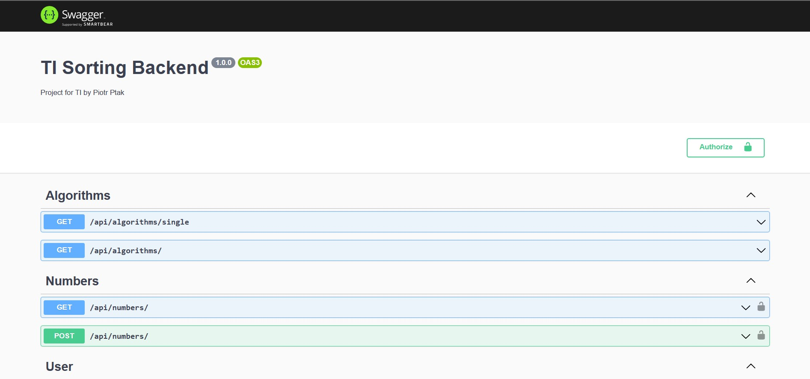

# Sorting Algorithms Visualization

## Table of contents

- [General info](#general-info)

- [Technologies](#technologies)

- [Usage](#usage)

- [Updates](#updates)

## General info

This is the backend part of the project for university course.
Frontend part is located [here](#).

## Technologies

- NodeJS
- ExpressJS
- Mongoose
- SwaggerUI
- socket.io

## Usage

In order to visit site, use this [link](#).
This project contains Swagger UI that serves as documentation.

It is possible to run this project locally or on Azure.
If you want to run it in Microsoft Azure, make sure that proper app service exists. You can utilize below command (if you have Azure Powershell installed).
Next follow regular steps regarding publish profile secret retrieval mentioned in workflows file.

```powershell
New-AzResourceGroupDeployment -ResourceGroupName "IT" -TemplateFile ".\deploy\main.bicep" -TemplateParameterFile ".\deploy\parameters.json"
```

**Important** : make sure to supply proper secrets values.
